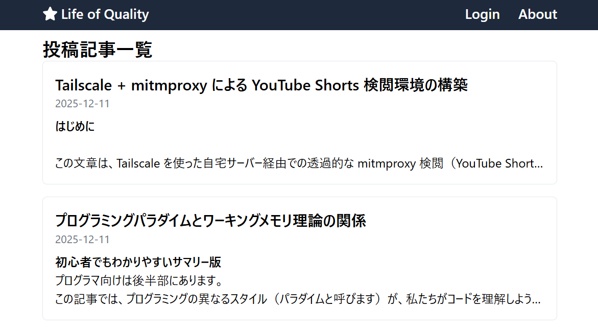
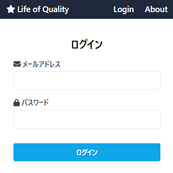
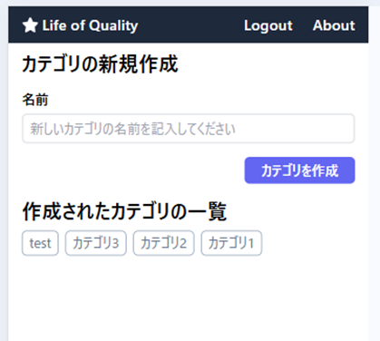
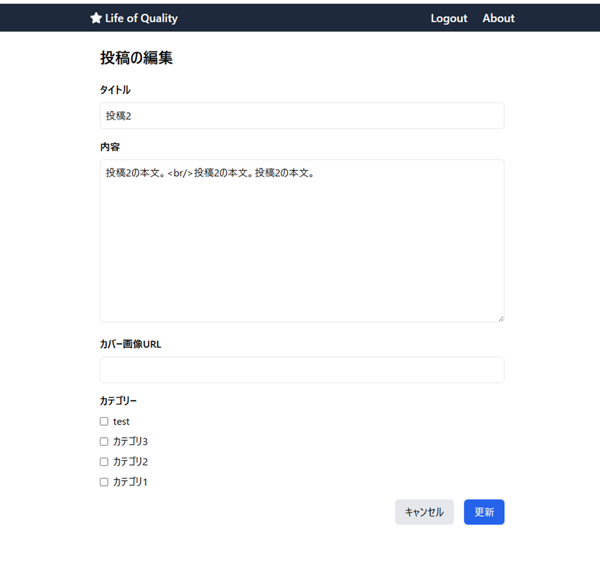
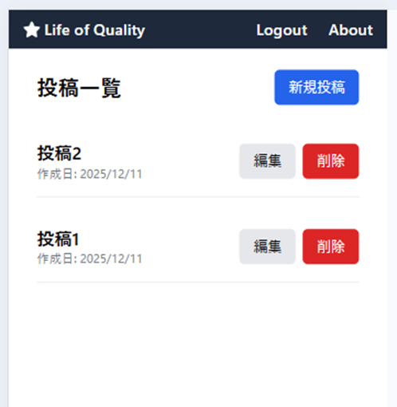
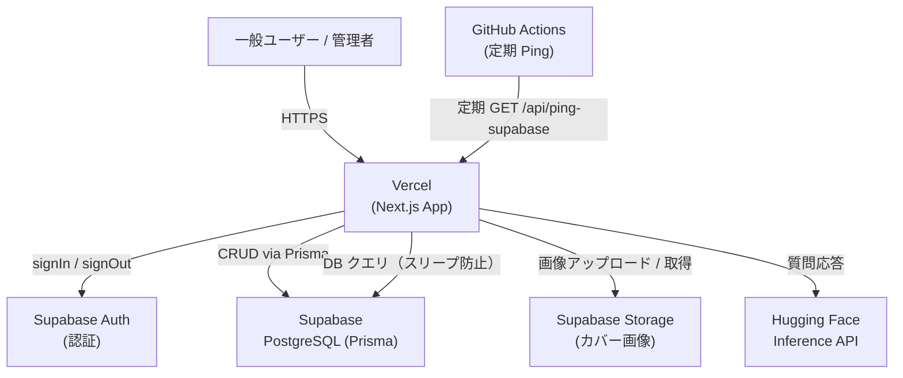

# Next.js ブログアプリ

> 公開デモ: [https://nextjs-gamma-six-48.vercel.app](https://nextjs-gamma-six-48.vercel.app)

## 概要

技術ブログを想定した個人向け CMS アプリ
ブログの閲覧だけでなく、管理者としてログインして記事・カテゴリの作成・編集・削除を行えます。

### 開発の背景・経緯

フロントエンドの学習として Next.js App Router・Prisma・Supabase を一通り組み合わせた実装経験を積むことを目的に開発しました。

## 特徴と機能


### 1. 記事一覧・詳細閲覧（一般ユーザー向け）

ログイン不要で全記事を閲覧できます。カテゴリ一覧から絞り込みも可能です。



### 2. 管理者ログイン（Supabase Auth）

メールアドレスとパスワードによる認証を Supabase Auth で実装しています。  
未ログイン状態で `/admin` 以下にアクセスするとログインページへリダイレクトされます（ルートガード実装済み）。




### 3. 記事の作成・編集・削除（管理者向け CRUD）

- タイトル・本文（リッチテキスト）・カバー画像・カテゴリを設定して記事を投稿できます。
- カバー画像は Supabase Storage にアップロードし、MD5 ハッシュによる重複排除を行っています。
- React Hook Form + zod によるフォームバリデーションを実装しています。
- 削除前には確認ダイアログを表示し、誤操作を防止しています。







## 使用技術（技術スタック）

言語: TypeScript
フレームワーク: Next.js 16 (App Router)

### ライブラリ
| 分類 | 名前 |
| --- | --- |
| UI ライブラリ | React 18 |
| スタイリング | Tailwind CSS, tailwind-merge |
| フォーム | React Hook Form, zod, @hookform/resolvers |
| データフェッチ | SWR |
| ORM | Prisma |
| 認証 / ストレージ | Supabase (Auth + Storage) |
| UI コンポーネント | Headless UI, Font Awesome |
| 通知 | react-toastify |
| セキュリティ系 | isomorphic-dompurify（XSS 対策）, crypto-js（MD5 ハッシュ） |
| 日付処理 | dayjs |
### 開発ツール・サービス

IDE: VSCode
データベース: Supabase (PostgreSQL)
ストレージ: Supabase Storage
デプロイ: Vercel

### システム構成図



## セットアップ手順

### 必要な環境変数

`.env` ファイルに以下を設定してください。

```
DATABASE_URL=...          # Prisma が接続する PostgreSQL（Supabase の接続プール URL）
DIRECT_URL=...            # Prisma マイグレーション用の直接接続 URL
NEXT_PUBLIC_SUPABASE_URL=...       # Supabase プロジェクト URL
NEXT_PUBLIC_SUPABASE_ANON_KEY=...  # Supabase 匿名キー
PING_SECRET=...           # GitHub Actions からの Ping リクエスト認証用シークレット
```

### インストール・起動

```bash
# 依存パッケージインストール
npm install

# データベーススキーマ反映
npx prisma db push

# Prisma クライアント生成
npx prisma generate

# シードデータ投入
npx prisma db seed

# 開発サーバー起動
npm run dev
```

### ビルド・本番起動

```bash
npm run build
npm start
```

> 注意: `prisma/schema.prisma` を大きく変更した場合は、既存の DB をリセットしてから `db push → generate → seed` の順で再実行してください。


開発期間: 2024.10 ～ 2025.02 約50時間